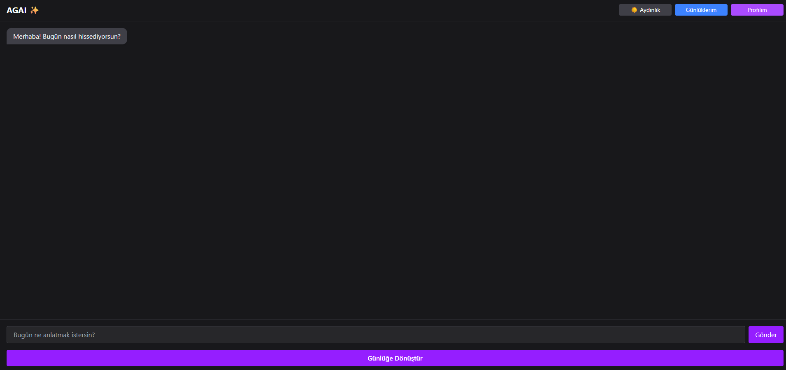

# AGAI – AI-Powered Journal and Companion (Showcase)

**AGAI** is a play on words: combining “aga” (a friendly Turkish address) and **AI**.  
It’s designed to be more than just a chatbot — AGAI is your digital friend, emotional support system, and personal journal combined.

---

## 🧠 Project Vision

AGAI aims to create a personal space where users can chat with an AI that feels like a **psychologist, friend, or mentor** — depending on their needs. After each conversation, users can convert the chat into a diary entry and keep it stored safely.  
It merges emotional support and digital journaling in a single elegant system.

---

## ⚙️ Technologies Used

- ⚛️ React (Vite.js)
- 🎨 Tailwind CSS
- 🛢️ Supabase (Auth & DB)
- 🤖 LLM integration planned (local model with custom personality tuning)

---

## ✅ Features Implemented

- 💬 AI-like chat interface (currently placeholder messages)
- 🌗 Dark-Light theme toggle with persistent state
- 🔐 Supabase Auth system (Email verification & login flow)
- 🙍‍♂️ Profile page with avatar upload & personal data update
- 📔 “My Journals” list with notebook-style page transitions
- 📝 Add new entries with title, content, and category
- 🪄 “Convert Chat to Journal” button after conversations
- 🎭 Onboarding screen for new users (“Let’s get to know you” flow)
- 🔓 Logout & Delete Account features
- 🧩 Fully animated transitions and scroll-synced components

---

## 📸 Screenshots

---

## 🔒 Note

This is a **startup project**, so the full codebase is **private**.  
This repository is for **showcase purposes only**.  
If you're interested in the product vision or collaboration, feel free to reach out.

---

## 🚧 Upcoming Plans

- Integration with a local LLM (e.g., OpenChat or Mistral)
- Emotion-based tone detection in chats
- Journal analytics (mood tracking, activity insights)
- Custom AI personalities
- Shareable summaries

---

## 📬 Contact

[LinkedIn](https://www.linkedin.com/in/burak-can-880569248/)  
[GitHub](https://github.com/BuraqJann)

---

© 2025 Burak CAN. All rights reserved.
